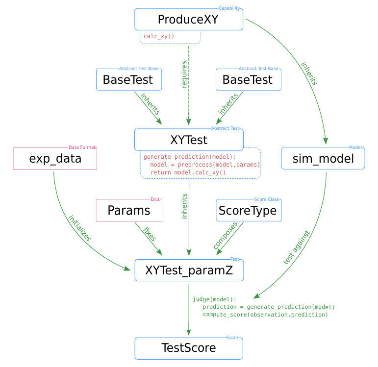

# NetworkUnit
A [SciUnit](https://github.com/scidash/sciunit) library for validation testing of spiking networks.

### Concept
The NetworkUnit module builds upon the formalized validation scheme of the SciUnit package, 
which enables the validation of *model*s against experimental data (or other models) via *tests*.
A test is matched to the model by *capabilities* and quantitatively evaluated by a *score*.
The following figure illustrates a typical test design within NetworkUnit. 
The blue boxes indicate the components of the implementation of the validation test, 
i.e. classes and class instances. The red boxes represent the data input, 
i.e. experimental data and parameter specifications. 
The relation between the boxes are indicated by annotated arrows. 
The relevant functionality of some components for the computation of test 
score is indicated by pseudo-code. The capability class ProduceXY contains 
the function calc_xy(). The test XYTest has a function generate_prediction() 
which makes use of this capability, inherited to the model class, 
to generate a model prediction. The initialized test instance XYTest_paramZ 
makes use of its judge() function to evaluate this model prediction and 
compute the score TestScore.



A showcase example on how to use NetworkUnit can be found [here](https://web.gin.g-node.org/INM-6/network_validation).

### Overview of tests

| Class name | Parents | Prediction measure |
| -------- | -------- | -------- | 
|two_sample_test                    | - | - |
|correlation_test                   | two_sample_test | - |
|correlation_dist_test              | correlation_test | correlation coefficients |
|correlation_matrix_test            | correlation_test | correlation coefficient matrix |
|generalized_correlation_matrix_test| correlation_matrix_test | matrix of derived cross-correlation measures |
|eigenvalue_test                    | correlation_test | eigenvalues of the correlation coefficient matrix |
|covariance_test                    | two_sample_test | covariances |
|firing_rate_test                   | two_sample_test | firing rates |
|isi_variation_test                 | two_sample_test | inter-spike-intervals, their CV, or LV |
|graph_centrality_helperclass       | sciunit.Test | graph centrality measures of given adjacency matrix |

Inheritance order in case of multiple inheritance for derived test classes: 
```python 
class new_test(sciunit.TestM2M, graph_centrality_helperclass, parent_test_class)
```

### Overview of scores

| Class name | Test name | Comparison measure |
| --------  | -------- | -------- | 
|students_t | Student't test | sample mean |
|ks_distance | Kolmogorov-Smirnov test | sample distribution |
|kl_divergence | Kullback-Leibler divergence | sample entropy |
|mwu_statistic | Mann-Whitney U test | rank sum |
|LeveneScore | Levene's test | sample variance |
|effect_size | Effect size | standardized mean |
|best_effect_size | Bayesian estimation effect size | standardized mean |

### Overview of model classes

| Model name | Capability | Parents | Purpose |
| --------  | -------- | -------- | -------- | 
|simulation_data | - | sciunit.Model | loading simulated data |
|spiketrain_data | ProducesSpikeTrains | simulation_data | loading simulated spiking data |
|stochastic_activity | ProducesSpikeTrains | sciunit.Model | generating stochastic spiking data |

### Other validation test repositories
- [NeuronUnit](https://github.com/BlueBrain/neuronunit)
- [HippoUnit](https://github.com/apdavison/hippounit)
- [BasalUnit](https://github.com/appukuttan-shailesh/basalunit)
- [MorphoUnit](https://github.com/appukuttan-shailesh/morphounit)
- [CerebellumUnit](https://github.com/lungsi/cerebellum-unit)

